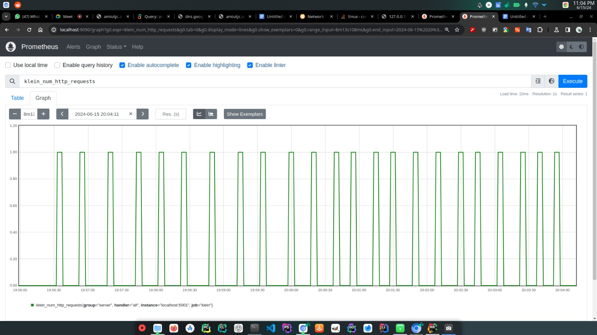

<h1 align="center">
  <br>
  <a href="http://localhost">
    
  </a>
  <br>
  Load Balancer Task
  <br>
</h1>

<p align="center">
  
</p>

<h1 align="center">Load Balancer Task</h1>
<h4 align="center"> Distribution of requests from multiple clients</a>.</h4>

<p align="center">
<a href="https://www.rust-lang.org/">
    
</a>
<a href="https://prometheus.io/">
    
</a>
<a href="https://www.nasa.gov/">
    
</a>
<a href="https://www.docker.com/">
    
</a>


</p>

<p align="center">
  <a href="#overview">Overview</a> •
  <a href="#key-features">Key Features</a> •
  <a href="#how-to-run">How To Run</a> •
  <a href="#analysis">Analysis</a> •
  <a href="#contributions">Contributions</a> 


</p>

---

<div style="background-color:#f8f9fa; padding:10px; border-radius:5px; margin-bottom:20px;">
  <p style="font-size:1.1em; text-align:center;">
    Before all the shenanigans, here is the <a href="#analysis" style="text-decoration:none; color:#007bff;"><b>analysis</b></a> if you want to dive right into the most important part of this project.
  </p>
</div>

---
## Overview

This project involves implementing a load balancer that distributes requests from multiple clients asynchronously among several servers to evenly distribute the load. You can have a look at the task here: [DS_Assign_LB_2024.pdf](./useful-docs/DS_Assign_LB_2024.pdf)

The load balancer uses consistent hashing to manage multiple replicas of a service. 
We are additionally using <b>*Rust*</b> for its performance and memory safety, <b>*Prometheus*</b> for monitoring and gathering metrics, <b>*NASA API*</b> as our backend service for demonstrating the load distribution and <b>*Docker*</b> providing an isolated environment for running the server instances.

-  Chosen for its performance, concurrency capabilities, and memory safety features which are critical for implementing an efficient load balancer.
-  Utilized for monitoring the application, collecting metrics, and providing insights into the system's performance and load distribution.
-  Serves as our backend service to simulate real-world load and demonstrate the effectiveness of the load balancer.
-  Ensures that the application runs consistently across different environments by packaging the application and its dependencies into a container. 


### Key Features

1. **Consistent Hashing**:
   - Implementation of consistent hashing to evenly distribute the load across multiple server instances. This technique ensures a balanced distribution and efficient handling of requests.

2. **Dynamic Server Management**:
   - Adding and removing server instances dynamically. The project includes functionality to start new Docker containers for servers and remove them as needed.

3. **Heartbeat Monitoring**:
   - Implementation of heartbeat checks to monitor the health of server instances. This ensures that the load balancer can detect server failures and take appropriate actions, such as spawning new instances.

4. **Prometheus Integration**:
   - Use of Prometheus for monitoring and gathering metrics. This integration helps in tracking the performance and load distribution across server instances, providing valuable insights for analysis.

5. **Fault Tolerance**:
   - The ability to quickly handle server failures by spawning new instances to maintain availability. This ensures that the system remains robust and reliable even in the face of individual server failures.

6. **Scalability**:
   - Testing and demonstrating scalability by incrementing the number of server instances and observing the load distribution. This feature highlights the load balancer's ability to efficiently manage increased load.

7. **Asynchronous Request Handling**:
   - Handling multiple client requests asynchronously to improve performance and responsiveness. This is crucial for efficiently managing high volumes of incoming requests.

8. **Docker Containerization**:
   - Containerization of server instances using Docker. This provides an isolated and consistent environment for running the servers, making it easier to manage and deploy the application.


## How To Run

>⚠️ **Platform Compatibility Warning**
> 
>This project has been tested and confirmed to work on Linux-based platforms, including:
<b>Ubuntu</b>, <b>Manjaro</b> and <b>CentOS</b>.
> 
> If you are using Windows or Mac, it is recommended to access the application using Docker to ensure compatibility. Follow the Docker setup instructions provided in the documentation to run the application on these platforms.


To clone and run this application, you'll need the following tools installed on your computer:
  -  [Git](https://git-scm.com)
  - [Docker](https://www.docker.com/)
  - [Python](https://www.python.org/)


- **Step 1:** **Clone this repository:**
    ```bash
    git clone https://github.com/nerdistry/Customizable-Load-Balancer.git 
    ```

- **Step 2:** **Navigate into the project directory:**
    ```bash
    cd Customizable-Load-Balancer
    ```
- **Step 3:** **How to actually implement the task:**
  - **Step 3.1:** **Add servers to the load balancer:**
    ```bash
    curl "http://localhost:5001/add" -X POST -H "Content-Type: application/json" -d '{"n":1,"names":["hate","love","big","small"]}' | jq
    ```
    This command sends a POST request to the load balancer to add new servers. 

    The `-d` option specifies the data to be sent in JSON format, adding servers named "hate", "love", "big", and "small". 
    
    The `jq` tool is used to format the JSON response.
    After adding the servers the response should look like the image below:
      
          This response indicates the status of the server addition process. A status of `0` or `1` means success anything else is an error.

    Monitor the errors. An error might look like this:
     
          This shows that you have already added the servers under the same name. Recall that server names are unique, hence the error.

  - **Step 3.2:** **Start multiple requests:**
    ```bash
    ./start_multiple.sh
    ```
    This script sends multiple requests to the load balancer, changing the dates and logging the request paths, servers used, and response times.

    Make sure to monitor the logs; the logs will show the details of each request sent and the corresponding responses. This helps in analyzing the load distribution and performance of the load balancer.

    Here's how it looks on our end:
     

  - **Step 3.3:** **Monitoring with Prometheus:**
   From the Prometheus metrics endpoint, we gathered various statistics, and we were able to monitor the state of the application. Example metrics as below:
    ```plaintext
    klein_http_request_duration_seconds_bucket{handler="big",le="0.005"} 0
    klein_http_request_duration_seconds_bucket{handler="big",le="0.01"} 0
    klein_http_request_duration_seconds_bucket{handler="big",le="0.025"} 0
    klein_http_request_duration_seconds_bucket{handler="big",le="0.05"} 0
    klein_http_request_duration_seconds_bucket{handler="big",le="0.1"} 0
    klein_http_request_duration_seconds_bucket{handler="big",le="0.25"} 0
    klein_http_request_duration_seconds_bucket{handler="big",le="0.5"} 0
    klein_http_request_duration_seconds_bucket{handler="big",le="1"} 0
    klein_http_request_duration_seconds_bucket{handler="big",le="2.5"} 5
    klein_http_request_duration_seconds_bucket{handler="big",le="5"} 5
    klein_http_request_duration_seconds_bucket{handler="big",le="10"} 5
    ```
 
     And some metrics as observed from the Prometheus interface:

    
    
    > **📝 N O T E**
    >
    > The graph above shows the total number of HTTP requests received over time. It illustrates the frequency of incoming requests and helps in understanding the load pattern. A consistent pattern indicates a steady load, while spikes or drops may indicate periods of high or low traffic.
    >
    > **Importance:** Monitoring the number of HTTP requests helps in understanding the load on the system and planning for scaling resources accordingly.

    

    > **📝 N O T E**
    >
    > This graph displays the distribution of HTTP request durations across different buckets (time intervals). Each line represents a different server instance, showing how long it takes to process requests.
    >
    > **Importance:** Analyzing the request duration helps in identifying performance bottlenecks and ensuring that requests are handled within acceptable time limits.

     
    
    > **📝 N O T E**
    >
    > This graph shows the cumulative sum of HTTP request durations over time for different server instances. It provides an aggregate view of the total time spent processing requests.
    >
    > **Importance:** Monitoring the total duration helps in understanding the overall load on each server and ensuring that no single server is overwhelmed.

    

    > **📝 N O T E**
    >
    > This graph shows the total count of HTTP requests processed by each server instance. It illustrates how the load is distributed across different servers.
    >
    > **Importance:** Ensuring an even distribution of total HTTP requests is crucial for maintaining balanced load distribution and preventing any single server from becoming a bottleneck.
    
    
## Analysis

Answering task four of the assignment: [DS_Assign_LB_2024.pdf](./useful-docs/DS_Assign_LB_2024.pdf)

### Question A - 1

**Task:** Launch 10,000 async requests on N = 3 server containers and report the request count handled by each server instance in a bar chart. Explain your observations in the graph and your view on the performance.

**Observations:**

1. **Request Count Handled by Each Server Instance:**
   
   
   
   The graph above shows the distribution of 10,000 async requests across 3 server containers (`n1`, `n2`, and `n3`).

2. **Performance Analysis:**

   - **Even Distribution:** it shows that the load balancer distributed the requests relatively evenly across the three servers. Server `n1` handled the most requests, followed by `n2`, and then `n3`.
   - **Efficiency:** the load balancer efficiently managed the incoming requests, ensuring that no single server was overwhelmed. This balanced approach helps in maintaining optimal performance and prevents any server from becoming a bottleneck.
   - **Scalability:** this observation indicates that the load balancer can scale effectively by adding more servers and still maintain an even distribution of requests.

**View on Performance:**

The load balancer's performance in handling 10,000 async requests with 3 server containers is highly efficient. The relatively even distribution of requests indicates that the load balancer is functioning correctly, providing a balanced load across all servers. This ensures that the system can handle high traffic volumes without any single point of failure, making it a robust solution for scalable applications.

### Question A - 2

**Task:** Increment N from 2 to 6 and launch 10,000 requests on each such increment. Report the average load of the servers at each run in a line chart. Explain your observations in the graph and your view on the scalability of the load balancer implementation.

**Observations:**

1. **Load Distribution Across Server Instances:**
   
   
   
   The line chart above shows the total HTTP requests handled by the server instances as N increments from 2 to 6.

2. **Cumulative HTTP Request Duration:**
   
   
   
   The graph above illustrates the cumulative sum of HTTP request durations over time for different server instances as N increments from 2 to 6.

**Performance Analysis:**

- **Incremental Load Handling:** As the number of server instances (N) increases from 2 to 6, the load balancer efficiently distributes the incoming 10,000 requests across the available servers. The total number of HTTP requests handled by each server is well-distributed, indicating that the load balancer effectively balances the load regardless of the number of servers.
  
- **Cumulative Request Duration:** The cumulative HTTP request duration graph shows a steady increase in total duration as more servers are added. Each server instance contributes to handling the load, which helps in distributing the request processing time evenly. This steady increase in duration indicates that the load balancer scales effectively with the addition of more servers.

- **Scalability:** The load balancer demonstrates excellent scalability. As more servers are added, the load distribution remains balanced, and the system continues to handle a high volume of requests without any single server becoming a bottleneck. This scalability ensures that the system can accommodate increased traffic by simply adding more server instances.

**View on Scalability:**

The load balancer implementation showcases impressive scalability. By incrementally increasing the number of server instances from 2 to 6, the load balancer continues to distribute the requests evenly and maintains optimal performance. The system's ability to scale efficiently with the addition of more servers highlights its robustness and suitability for handling varying levels of traffic, making it a reliable solution for scalable applications.

## Contributions

---

> GitHub [@nalugala-vc](https://github.com/nalugala-vc) &nbsp;&middot;&nbsp;
> GitHub [@fanisheba](https://github.com/nerdistry) &nbsp;&middot;&nbsp;
> GitHub [@etemesi254](https://github.com/etemesi254) &nbsp;&middot;&nbsp;
> GitHub [@some-casual-coder](https://github.com/some-casual-coder) &nbsp;